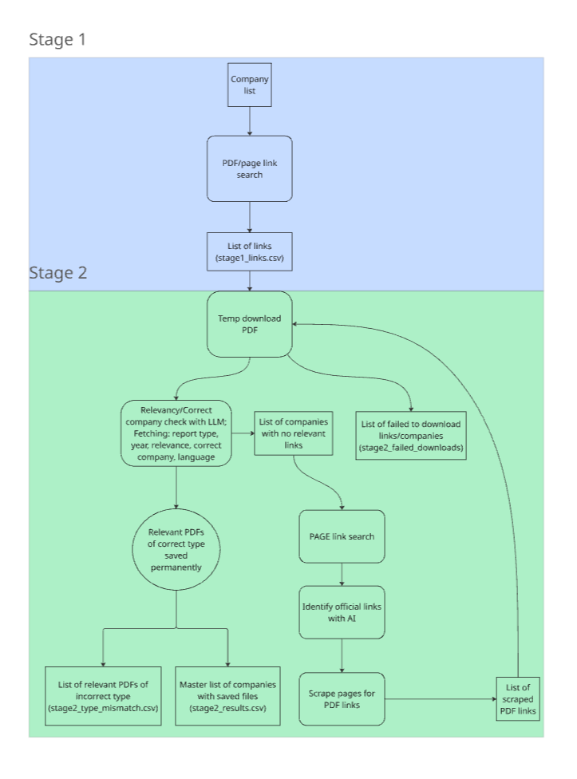

# City Scout
## What it does?
Find Climate Action Plans for Cities, and Regional Governments. 


## How it Works



## How to Run
### Create and activate venv
```
# Create the venv
python -m venv .venv

# Activate the venv
source .venv/bin/activate
```
### Setup the environment variables
Create a copy of env.example, and add your OpenAI, and ScaleSERP API keys. 

### Install packages using pip
```
pip install -r requirements.txt
```
### Add cities to check for to a csv following the cities_csv_template.csv template.
### Run run_pipeline.py --input-csv <csv_file>
```
run_pipeline.py --input-csv cities_csv_template.csv
```