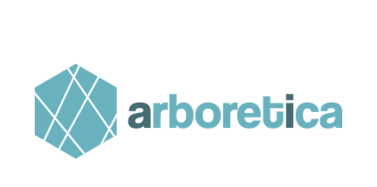

<h1 align="center">Report Scout</h1>
<p align="center">
  <b>Find, download, and classify company Sustainability & ESG reports - automatically.</b>
</p>

<p align="center">
  <a href="https://github.com/OWNER/REPO/stargazers"></a>
  <a href="https://github.com/OWNER/REPO/actions"></a>
  
  <a href="LICENSE"></a>
  <a href="https://github.com/OWNER/REPO/issues?q=is%3Aopen+is%3Aissue+label%3A%22good%20first%20issue%22"></a>
  <a href="https://github.com/OWNER/REPO/issues"></a>
</p>

<p align="middle">
  
</p>

> ⭐️ **If this project helps you, please give it a star!** Stars help others discover it.

---

## 🌍 What is Report Scout?

**Report Scout** is a two-stage Python pipeline that finds, downloads & classifies any company's sustainability/ESG reports (PDFs).  
It uses **ScaleSERP** for discovery and **OpenAI** for text classification (relevance, report type, year), saving clean artifacts under `outputs/`.

> **TL;DR**: Provide a CSV of companies → run one command → get a folder of vetted sustainability reports per company + CSV summaries.

---

## ✨ Features

- 🌐 **Multilingual search** with per-country Google domains (auto native language ↔ English fallback).
- 🔎 **Stage 1**: Discover & score `pdf_linkN` / `page_linkN` candidates per company.
- 📥 **Stage 2**: Download PDFs, extract text, classify via LLM, and **save only acceptable reports**.
- 🧠 **Heuristic scoring** to prefer official company sites & recent years.
- 🧹 Clean CSV artifacts for links, results, failed downloads, and type mismatches.
- 🗂️ Structured outputs (`outputs/pdfs`, `outputs/html`, temp dirs) with collision-safe names.

---

## How it Works


## Project Layout

```
report_fetcher/
  __init__.py
  config.py             # global settings (paths, API keys, report types, limits)
  search.py             # Stage 1: ScaleSERP discovery + multilingual scoring
  pipeline_stage1.py    # Stage 1 orchestration and link table
  pipeline_stage2.py    # Stage 2 orchestration, fallbacks, result tables
  fetch.py              # Robust PDF download + HTML fallback parsing
  pdf_utils.py          # PDF text extraction + save/classify gate
  classify.py           # OpenAI classification helpers
  utils.py              # Link scoring & selection utilities
run_pipeline.py         # CLI entry point
```

---

## Installation

1) **Python 3.10+** recommended.

2) Install dependencies (example with `uv` or `pip`):
```bash
# using uv
uv pip install -r requirements.txt

# or pip
pip install -r requirements.txt
```

> If you don't keep a `requirements.txt` yet, you'll likely need:  
> `pandas tqdm requests beautifulsoup4 PyMuPDF python-dotenv openai`.

3) Set environment variables (or a `.env` file next to `run_pipeline.py`):
```bash
OPENAI_API_KEY=sk-...
SCALESERP_API_KEY=...
```

> The CLI also lets you pass `--openai-api-key` and `--scaleserp-api-key` directly.

---

## Quick Start

Prepare a CSV with two columns: `Company` and `Country` (column names are configurable). Example:

```csv
Company,Country
ABB,Switzerland
Telefónica,Spain
```

Run the pipeline:

```bash
python run_pipeline.py --input-csv companies.csv -vv
```

- `-v`  → INFO logs  
- `-vv` → DEBUG logs

Outputs land in `outputs/` (configurable), including:
- `outputs/stage1_links.csv`
- `outputs/stage2_results.csv`
- `outputs/stage2_failed_downloads.csv`
- `outputs/stage2_type_mismatch.csv`
- downloaded PDFs under `outputs/pdfs/`

---

## How it Works

### Stage 1 — Discover links
- For each company, runs two ScaleSERP queries:
  - **PDF results** (`filetype:pdf`)
  - **Non‑PDF page results** (`-filetype:pdf`)
- Ranks results with a heuristic that favors:
  - company domain matches, recent years in snippets/URLs, accepted report‑type keywords/synonyms, clean URLs, and known good path segments.
- Produces a table with `pdf_link1..N` and `page_link1..N` per company.

### Stage 2 — Classify & save
- Visits PDF links first; if none are saved, can process page links:
  - Filters for likely official pages (domain match), scrapes for deeper PDF links, caps per domain / global totals.
- Downloads PDFs (with realistic headers and a fallback HTML parse if a viewer page is returned).
- Extracts text (first ~10–15 pages) and asks an LLM for:
  - `Relevance` (Yes/No),
  - `CorrectCompany` (Yes/No),
  - `ReportType` (raw label),
  - `Year` (latest 4‑digit year).
- Keeps the file **only if**:
  - `Relevance=Yes` and `CorrectCompany=Yes`,
  - the `Year` is within the configured minimum (e.g., ≥ 2023),
  - the `ReportType` maps to an allowed canonical type (**no cross‑upgrades**; strict contains‑match).
- Files are saved as: `Company_CanonicalType_Year[_#].pdf` (collision‑safe).

---

## Configuration

All knobs live in **`report_fetcher/config.py`**. Common options:

- **Paths**
  - `BASE_DIR` (default `outputs/`), `PDF_DIR`, `HTML_DIR`, `TEMP_PDF_DIR`, `CONFIRMED_PDF_DIR`
- **API & Model**
  - `OPENAI_API_KEY`, `SCALESERP_API_KEY`, `OPENAI_MODEL` (default `gpt-5-mini`)
- **Report Types**
  - `ACCEPTABLE_REPORT_TYPES` (default: `["Annual","Integrated","CSR","ESG","Impact","CDP"]`)
- **Search (Stage 1)**
  - `MAX_PDF_RESULTS`, `MAX_PAGE_RESULTS`
  - `SEARCH_LANGUAGE_PRIORITY = "native" | "english"`
  - `STAGE1_SCORING_ENABLED = True`
  - `COMPANY_NAME_COLUMN`, `COUNTRY_COLUMN`
- **Year Gate**
  - `MIN_ACCEPTABLE_REPORT_YEAR` (e.g., `2023`)
- **Stage 2 behavior**
  - `STAGE2_PAGE_PROCESSING_CONFIG = "process_if_no_pdfs" | "process_all" | "skip"`
  - per‑domain caps and overall caps for pages and PDFs

> You can also pass API keys via CLI. See **CLI** below.

---

## CLI

```bash
python run_pipeline.py   --input-csv companies.csv   --openai-api-key $OPENAI_API_KEY   --scaleserp-api-key $SCALESERP_API_KEY   -vv
```

If `--input-csv` is omitted, a tiny built‑in sample is used. The script writes cleaned CSVs (single `\n` line endings, trimmed strings, no blank “every second row” artifacts on Windows).

---

## Outputs

### `stage1_links.csv`
One row per company, plus columns:
- `pdf_link1..MAX_PDF_RESULTS`
- `page_link1..MAX_PAGE_RESULTS`

### `stage2_results.csv`
One row per company with:
- `Company`, `Country`
- `PDF files` — comma‑separated list of saved filenames

### `stage2_failed_downloads.csv`
Rows for any download that returned HTML, failed, or was unreachable.
- `Company`, `Country`, `Failed_Link`, `Reason`

### `stage2_type_mismatch.csv`
Reports judged relevant but with a **non‑accepted** report type.
- `Company`, `Country`, `PDF_Link`, `AI_Report_Type`, `AI_Year_Raw`, `Final_Year_Used`, `Reason`

Downloaded PDFs live in `outputs/pdfs/`.

---

## Development Notes

- **Logging:** use `-v`/`-vv` to increase verbosity.
- **.env support:** `.env` is loaded automatically if `python-dotenv` is installed.
- **HTTP strategy:** realistic headers, byte‑range requests, viewer‑page parsing, and simple origin warm‑ups.
- **LLM prompts:** strict one‑line output for easy parsing; only the **first pages** are read for speed.
- **Safety rails:** file‑type checks, year gates, strict report‑type canonicalization, domain filtering.

---

## Troubleshooting

- **“OpenAI configuration error”** → provide a valid key via env or `--openai-api-key`.
- **No PDFs found** → try `STAGE2_PAGE_PROCESSING_CONFIG="process_all"` or switch `SEARCH_LANGUAGE_PRIORITY`.
- **Type mismatch** (relevant but not in accepted list) → expand `ACCEPTABLE_REPORT_TYPES` if intended.
- **Corrupt/HTML PDFs** → downloader will attempt to parse viewers; some sites may still require manual handling.

---

## Contributing

Issues and PRs welcome! Please include reproducible examples (company + country), console logs (`-vv`), and your `config.py` deltas.

Start with our
[good first issues](https://github.com/OWNER/REPO/issues?q=is%3Aopen+label%3A%22good+first+issue%22)
or [help wanted](https://github.com/OWNER/REPO/issues?q=is%3Aopen+label%3A%22help+wanted%22).


---

## License

MIT License — see the [LICENSE](LICENSE) file for details.  
Copyright (c) 2025 **Arboretica B.V.**

---

## Authors

- Developed by **Markas Nausėda**, 2025  
- Copyright ownership: **Arboretica**

---

## Acknowledgements

- ScaleSERP for search results.
- OpenAI for text classification.
- PyMuPDF for fast PDF text extraction.

---

## ⭐ Star history
[](https://star-history.com/#OWNER/REPO)

